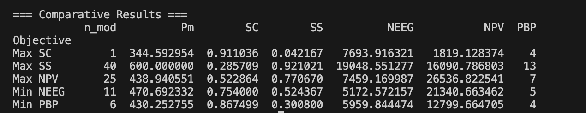
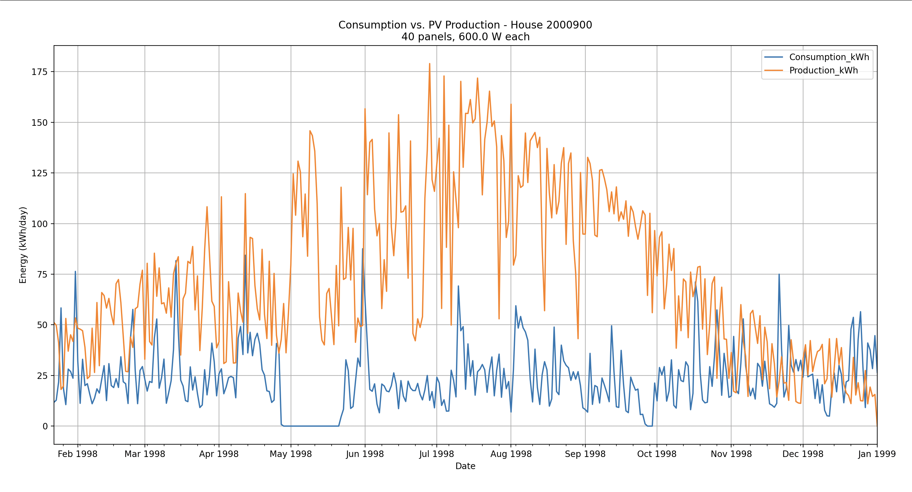

# Photovoltaic Panel Simulator

A Python-based simulator to size and optimize solar photovoltaic (PV) systems for residential households. Given real household energy consumption data and meteorological data from Grenoble, France, the simulator finds the optimal PV configuration based on multiple objectives.

## Overview

This project was developed as part of a 3rd-year internship at the Faculty of Automatic Control and Computer Science, Politehnica University of Bucharest (UPB - ACS).

The simulator models a household's energy consumption against PV system production and evaluates configurations across 5 optimization objectives simultaneously, helping identify the best system size for different priorities — whether that's maximizing energy independence, minimizing costs, or achieving the fastest return on investment.

## Features

- Models real solar irradiance and weather data for Grenoble, France
- Simulates daily PV production vs. household consumption
- Optimizes PV system configuration using Differential Evolution algorithm
- Evaluates 5 objectives in parallel:
  - **Max SC** — maximize self-consumption ratio
  - **Max SS** — maximize self-sufficiency ratio
  - **Max NPV** — maximize net present value over 30 years
  - **Min NEEG** — minimize net energy exchange with the grid
  - **Min PBP** — minimize payback period
- Calculates financial indicators: CapEX, NPV, and payback period
- Generates comparison charts of consumption vs. PV production over time

## Results

Analysis identified up to **15–20% potential energy savings** per household depending on system configuration and optimization objective chosen.

## Output

### Comparative Optimization Results


### Consumption vs. PV Production (Max SS configuration — 40 panels, 600W each)


## Tech Stack

- Python
- NumPy
- Pandas
- SciPy (Differential Evolution optimizer)
- Matplotlib
- BATEM — a photovoltaic simulation library provided by Politehnica University of Bucharest

## Project Structure
```
├── main.py          # Optimization runner and results visualization
├── simulate.py      # Core simulation and financial calculation logic
```

## Note

The household energy consumption dataset and meteorological data are not included in this repository as they were provided as part of a university assignment. The BATEM library is proprietary to Politehnica University of Bucharest and is not included.
